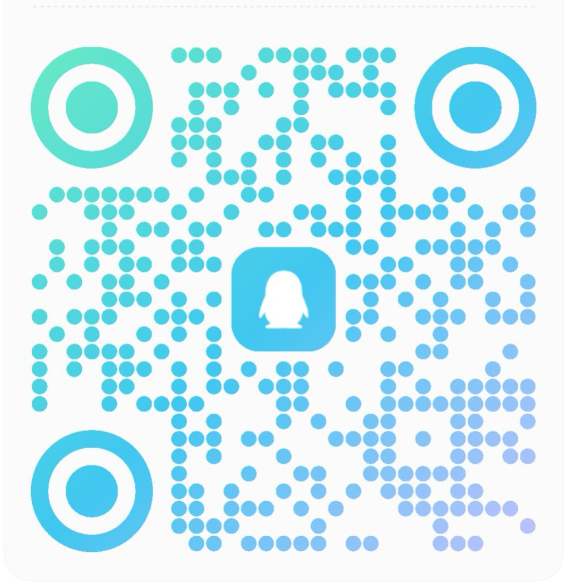

# DeepWhale Desktop (深鲸桌面)

> A cross-platform desktop shell that wraps the [DeepSeek Harness](https://github.com/deepseek-ai/deepseek-harness) (DSH) web UI into a native Electron window.

[中文](README.md) · **English**

> 🏠 [Homepage](https://feely0208.github.io/deepwhale-desktop) · [Releases](https://github.com/feely0208/deepwhale-desktop/releases)


## ✨ Free Forever · Open Source · No Tricks

- 💯 **Free forever** — no in-app purchases, no subscriptions, no ads, no hidden fees, and it will stay that way.
- 🌍 **Open source** — the full source is public on GitHub (MIT): auditable, PR-friendly, and free to fork and build upon.
- 🔒 **Your data stays yours** — API keys are encrypted with the OS keychain and stay on your machine; balances come straight from DeepSeek's official API with no third-party relay.
- 🚫 **No reselling** — if anyone ever tries to sell you this software, refuse and let us know.

## Features

- 🖥️ **Native window**: launches or reuses your local DSH service and tears down the whole process tree on exit (no orphan node processes); closing the window minimizes to the tray
- 🎨 **Background skins**: pick any image to fully cover the UI (works in both light and dark mode without changing DSH's base theme), adjustable opacity, extends into the sidebar with a gradient transition
- 🐾 **Desktop pet**: sprite-sheet animated pet with walking / fast walking / jogging / fast running / working / waving / jumping actions; bring your own SVG/GIF/PNG pets via the pet workshop
- 💰 **Usage & quota**: a corner panel plus a "Usage" section in the DSH settings page — balance / gift / top-up / today's requests / tokens, with a green progress bar and low-balance alerts
- 🔑 **API key safety**: `safeStorage` (OS keychain) encryption — never stored in plain text; or enter it inline in the settings page
- 📦 **3-platform packages**: macOS `.dmg`, Windows `.nsis`, Linux `.AppImage` / `.deb`, built by GitHub Actions

## Quick Start

Requirements: Node.js ≥ 18 (≥ 20 recommended).

```bash
npm install
npm run dev        # build + launch (starts or reuses your local DSH web UI)
```

A default `userData/settings.json` is generated on first run; if a DSH instance is already running on port 3080, it is reused instead of starting a second one.

## Feature Details

### Background Skins (skin = background image)
- Tray menu → Skin → **Background image…**; the image is copied into `userData/skins/` and inlined as a data URI (applies instantly)
- Covers the whole window; the UI layer becomes semi-transparent; background opacity adjustable (30%–100%)
- Works in **both light and dark mode** — brightened in light mode, dimmed in dark mode, without changing DSH's base theme appearance
- The image extends into the left sidebar (faded with a gradient)

### Desktop Pet
- Built-in **AI小助理** (sprite-sheet animation, 192×208 cells, row = state): idle breathing, waving on hover, jumping on click, walk/jog/run depending on drag speed, periodic "working at the computer"
- **Sprite pet format**: drop a folder named after the pet containing `manifest.json` + `spritesheet.png` and it is recognized and played automatically
- **Custom pets**: use the pet workshop (live SVG editing, import images with background removal), or drop `.gif` / `.svg` / `.png` / `.jpg` / `.webp` files into the pets folder
- Settings page → Pets: preview, switch pets, show / click-through toggles, **animation frame-rate and size sliders**

### Usage & Quota
- Collapsible corner panel + DSH settings → Usage: total balance / gift / top-up / today's requests / cumulative tokens
- Data source: official `GET https://api.deepseek.com/user/balance`; green progress bar (balance sufficiency + composition)
- Low-balance alerts (default ¥5 threshold); auto-refresh every 5 minutes by default, with manual refresh available
- ⚠️ **Usage monitoring requires an API key**: enter your `sk-...` key in **Settings → Usage** and click **Save Key** (or paste an `sk-` key anywhere in the DSH settings page — it syncs automatically on blur). Without a key the balance/usage panel shows "—"; **DSH itself still works normally**
- 🔍 **Why a key is needed**: balance/usage data comes from DeepSeek's **official API** `api.deepseek.com`, which requires authentication with **your own key** — the app does not collect keys. Keys are encrypted with the OS keychain and only ever go to DeepSeek's official endpoint; the **source is fully public and auditable** (see [SECURITY.md](SECURITY.md))

### API Key Configuration
- Two entry points, one store: tray → **Set API Key…** dialog, or the inline input in **Settings → Usage**
- Encryption: Electron `safeStorage` (OS keychain); falls back to obfuscated storage when the secure store is unavailable (never plain text)
- The environment variable `DEEPSEEK_API_KEY` is also supported (highest priority, injected when DSH starts)
- Balance requests only happen in the main process; the renderer only receives sanitized data

### Settings Page Integration
- Injects **Pets / Usage / Skin** sections into the DSH settings page navigation, consistent with the native UI

## Configuration (userData/settings.json)

| Key | Default | Description |
| --- | --- | --- |
| `command` | `npx @deepseek-ai/dsh web` | Command used to launch DSH; changeable to a local path |
| `port` | `3080` | DSH web UI port |
| `theme` | `system` | Native UI theme (follow system / light / dark, driven by nativeTheme) |
| `skinImage` | `null` | Background skin image file name (under `userData/skins/`) |
| `skinOpacity` | `0.55` | Background opacity (0.3–1) |
| `petVisible` | `true` | Whether the pet is shown |
| `petGif` | `AI小助理` | Current pet name |
| `petFrameMs` | `130` | Sprite animation speed (ms/frame) |
| `petScale` | `1` | Pet size (0.6–2) |
| `clickThrough` | `false` | Click-through pet |
| `closeToTray` | `true` | Minimize to tray when closing the window |
| `usagePanelVisible` | `true` | Show the usage panel |
| `usageRefreshMinutes` | `5` | Balance refresh interval (minutes) |
| `usageLowBalanceAlert` | `5` | Low-balance alert threshold (CNY) |
| `apiKeyEncrypted` | `null` | API key (base64 after safeStorage encryption; do not edit manually) |

## Development

```bash
npm run build          # tsc compile + copy static assets to dist/
npm run dev            # build and launch
npm run smoke          # smoke test: auto-launch, verify settings injection, exit after 8s (CI-ready)
npm run icons          # regenerate icons
npm run dist:mac       # package macOS dmg/zip
npm run dist:win       # package Windows nsis (needs Windows or CI)
npm run dist:linux     # package Linux AppImage/deb
```

### Project Layout

```
dsh-desktop/
├── src/
│   ├── main/                # main-process modules
│   │   ├── index.ts         # entry point: assembles all modules
│   │   ├── service-manager.ts  # spawn / detect / recycle the DSH process
│   │   ├── window.ts        # main window + injection hooks
│   │   ├── skin-manager.ts  # background skins
│   │   ├── pet.ts           # desktop pet window + sprite playback
│   │   ├── tray.ts          # tray + app menu
│   │   ├── usage-manager.ts # usage/quota collection, refresh, alerts
│   │   ├── settings-inject.ts # settings-page section injection
│   │   └── store.ts         # JSON settings read/write
│   ├── preload/preload.ts   # minimal IPC bridge (contextBridge)
│   ├── pet/                 # pet render page (canvas sprite playback)
│   ├── usage/               # corner usage panel
│   ├── settings/            # DSH settings extensions (pets / usage / skin)
│   ├── apikey/              # API key dialog
│   └── petstudio/           # pet workshop
├── assets/
│   ├── pets/                # built-in pets (sprite pet + SVG template, copied to userData/pets on first run)
│   └── icons/               # app / tray icons (generated by npm run icons)
└── scripts/                 # build helper scripts
```

## Packaging & CI

- `electron-builder.yml` configures mac (dmg/zip), win (nsis), linux (AppImage/deb); artifacts are named with version and arch, and are published to a GitHub Release draft
- `.github/workflows/build.yml`: 3-platform matrix build (PR/push), uploads artifacts
- `.github/workflows/release.yml`: pushing a `v*` tag auto-builds all platforms and publishes a **Draft Release** (reviewed before going public); see [RELEASING.md](RELEASING.md)
- Official macOS releases use Developer ID signing + notarization (`npm run preflight:mac` fail-loud checks; see [RELEASING.md](RELEASING.md))
- Cross-platform binaries must be built on their own OS or in CI; without signing certificates, CI produces unsigned packages (for evaluation/verification only)

## Roadmap

- [x] M1 Shell: Electron + TS, service manager, main window, tray
- [x] M2 Background skins: image overlay + light/dark adaption + sidebar gradient
- [x] M3 Desktop pet: sprite animation + multi-actions + pet workshop
- [x] M5 Usage panel: balance API + green progress bar + low-balance alerts
- [ ] M4 Packaging: 3-platform CI + signing/notarization
- [ ] Usage details: integrate online usage when DeepSeek opens a usage API
- [ ] Settings UI (currently settings.json + menu + settings-page injection)

## FAQ

**Is it paid?** Free forever, open source (MIT). No purchases, subscriptions, ads, or trials.

**Do I need to register or log in?** No. The only optional thing is your own DeepSeek API key (to view balance/usage in-app; DSH works fine without it).

**The usage panel shows no balance?** Enter your `sk-...` API key in **Settings → Usage** and click **Save Key** to fetch the balance (an `sk-` key pasted anywhere in the DSH settings page also syncs automatically). Without it the usage panel is unavailable, but DSH works normally.

**Is my API key safe?** It is encrypted with the OS keychain (`safeStorage`) and used only in the main process — never stored in plain text, never uploaded (see [SECURITY.md](SECURITY.md)).

**What is the relationship with DeepSeek Harness?** This is a community desktop shell built on DeepSeek Harness; it is **not an official DeepSeek product** and does not represent DeepSeek's position.

**Which platforms are supported?** macOS (dmg/zip), Windows (nsis), Linux (AppImage/deb).

## Contributing

Issues and PRs are welcome. Please read [CONTRIBUTING.md](CONTRIBUTING.md) first: keep modules single-purpose, handle errors gracefully, and avoid adding dependencies unless necessary.

## Contact

Scan to chat — questions, suggestions, and feedback welcome:

<table>
  <thead>
    <tr>
      <th align="center">WeChat Group</th>
      <th align="center">QQ Group</th>
    </tr>
  </thead>
  <tbody>
    <tr>
      <td align="center"></td>
      <td align="center"></td>
    </tr>
  </tbody>
</table>

## Security

See [SECURITY.md](SECURITY.md) for API key handling.

## Special Thanks

- [DeepSeek Harness](https://github.com/deepseek-ai/deepseek-harness) and the DeepSeek AI team — DSH itself

## Related Projects

The DeepSeek Harness ecosystem:

| Project | Description | Link |
| --- | --- | --- |
| DeepSeek Harness | DeepSeek's official agent framework (the foundation of this project). | [GitHub](https://github.com/deepseek-ai/deepseek-harness) |
| DeepSeek Harness 橙皮书 | Community field-testing handbook for DSH. | [GitHub](https://github.com/alchaincyf/deepseek-harness-orange-book) |
| Awesome DSH Plugin | Curated list of DSH community plugins. | [GitHub](https://github.com/awesome-dsh-plugin/awesome-dsh-plugin) |
| dsh-web-ui | DSH web UI plugins and skins. | [GitHub](https://github.com/zhu1090093659/dsh-web-ui) |
| dsh-TUI | Full-screen interactive terminal UI for DSH. | [GitHub](https://github.com/ccch1mneyyy/dsh-TUI) |
| DSH-better-sidebar | DSH sidebar workbench (files/terminal/git/subagents). | [GitHub](https://github.com/omdsh-dev/DSH-better-sidebar) |
| Awesome DeepSeek Harness | Curated DSH plugins, tools and infrastructure. | [GitHub](https://github.com/0xsline/awesome-deepseek-harness) |

## License

[MIT](LICENSE)

> This project is a community desktop build based on DeepSeek Harness; it is **not an official DeepSeek product** and does not represent DeepSeek's position.
> This project is completely open source and free. If anyone tries to sell you this software in any form, refuse the transaction.
